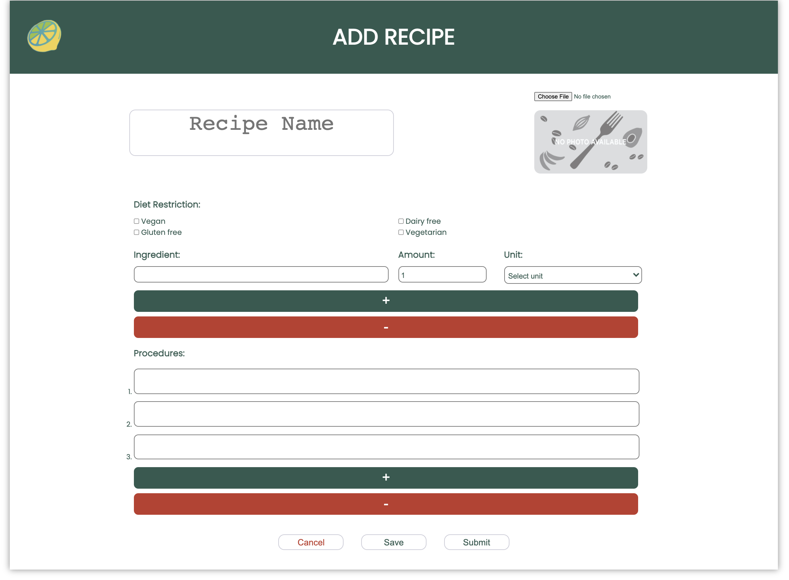
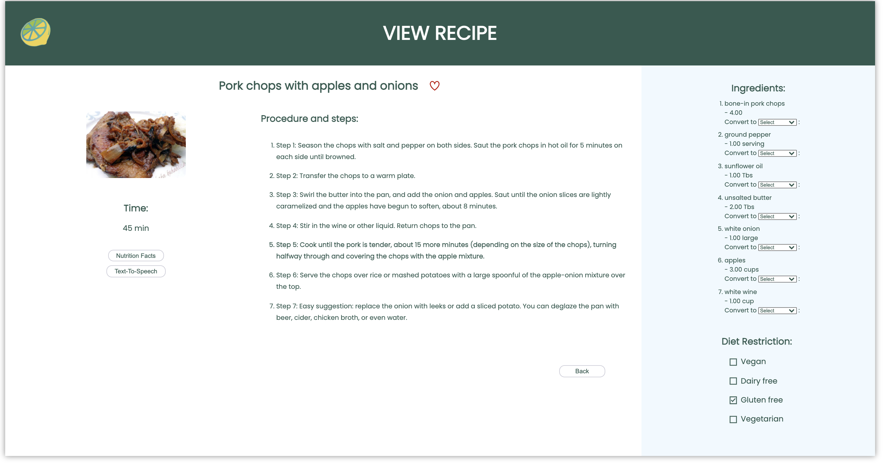
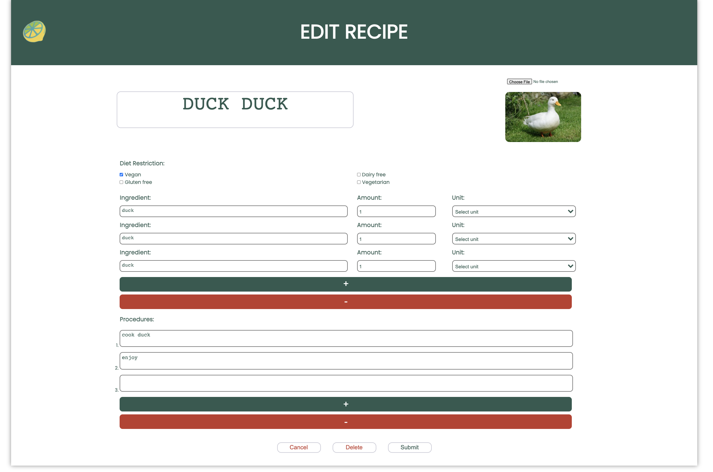

# Recipe Manager

# Overview 
Zest is a **recipe manager application** where users can explore new dishes as well as create their own. Similar to other apps such as *Paprika* and *Uber Eats*, our site provides simplicity as well as functionality to our users. Whether you're a novice cook or a master chef, ***Zest will freshen up your palettes***. 

    <a href="https://zeste.netlify.app/">Zest Official Site</a>
     
    <a href="https://cse110-fa21-group16.github.io/index.html">Documentation</a>
     
    <a href="admin/team.md">Team 16</a>
     
    <a href="admin/onboard.md">Onboarding Logistics</a>
     
    <a href="https://www.youtube.com/watch?v=h_vfEYurK9A">Private Video</a>

# Table of Contents 
1. [Tech Stack](#tech-stack) :books:
2. [CRUD](#crud) :collision:
3. [Features](#features) :eyes:
4. [Timeline](#timeline) :calendar:
6. [Credits](#credits) :credit_card:

# Tech Stack

# CRUD 
Zest is a **single page application** that utilizes **CRUD** functionality. 

## Create 
Users are able to create their **own recipes**. A recipe consists of a **name**, **image**, **diet restrictions**(optional), **ingredients**, and **procedures**. 
Additionally, if the user is not ready to submit their recipe, they can save it and come back to it later. 

## Read
Besides creating recipes, users can read either their own recipes or other recipes provided by the **spoonacular api**. The design follows a typical recipe card where the main content are the list of ingredients and the list of procedures. Furthermore, users can view the **nutrition facts**, **convert units**, and even say the recipe out loud through **text to speech**

## Update 
After creating a recipe, users can edit or update their own recipes. They can change all the same aspects from create. 

## Delete
Finally, whenever users decide to delete recipes, they can do so. As a user updates a page, there is a button at the **bottom center** saying "delete". Clicking on this button allows the user to remove the recipe that they created. However, there is a delete confirmation just to make sure the user really wants to delete the recipe.

# Features
In addition to the CRUD functionality, below is a list of additional features that make Zest truly unique 
- Search and filtering
- Favoriting recipes
- Ingredient unit conversions 
- Servings calculation
- Recipe draft saving

# Timeline
- Week 1-6: Research and Design 
    - [Brainstorm](./specs/brainstorm)
    - [Project Pitch](./specs/pitch/)
    - [User Interface](./specs/interface)
- Week 7: Sprint 1
    - [Assets](./source/assets)
    - [Sprint 1 Review](./admin/meetings/111421-sprint-1-review.md)
    - [Retrospective](./admin/meetings/111421-retrospective.md)
    - [Status Video](./admin/videos)
    - [Sprint 2 Setup](./admin/meetings/111621-sprint-2-setup.md)
- Week 8-9: Sprint 2
    - [ADRS](./specs/adrs)
    - [Pipeline](./admin/cipipeline)
    - [Testing](./__test__)
    - [Sprint 2 Review](./admin/meetings/112821-sprint-2-review.md)
    - [Retrospective](./admin/meetings/112821-sprint-2-retrospective-retrium-screenshot.png)
    - [Status Video](./admin/videos)
- Week 10: Bug Fixes and Touch ups 

# Credits 

    <a href="https://spoonacular.com/food-api">Spoonacular API</a>
</a>
